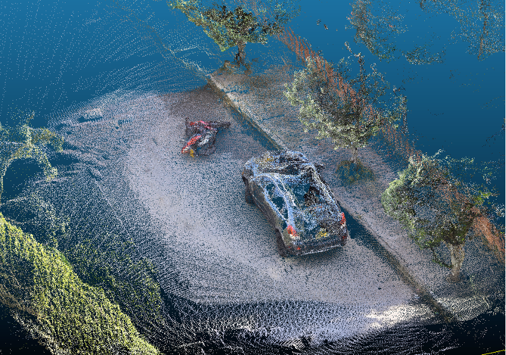

<div align="center">
  <a href="https://www.mit.edu/~arosinol/">
    
  </a>
</div>

<p align="center">
  <div align="center">
    <h1>AccuNeRF</h1>
  </div>
  <h1 align="center">
  ACCURATE 3D ACCIDENT RECONSTRUCTION USING NEURAL RADIANCE FIELDS</h1>
  <p align="center">
    <a href="https://www.adonaivera.com/"><strong>ADONAI VERA</strong></a>
    ·
    <a href="https://www.iu.de/hochschule/lehrende/grasnick-armin/"><strong>PROF. DR. ARMIN GRASNICK</strong></a>
  </p>
  <!-- <h2 align="center">In Review</h2> -->
  <h3 align="center">
    <a href="https://arxiv.org/abs/">Paper</a> |
    <a href="https://www.youtube.com/">Video</a> |
    <!-- <a href="">Project Page</a>-->
  </h3>
  <div align="center"></div>
</p>
<p align="center">
  <a href="#">
    
  </a>
</p>

<details open="open" style='padding: 10px; border-radius:5px 30px 30px 5px; border-style: solid; border-width: 1px;'>
  <summary>Table of Contents</summary>
  <ol>
    <li>
      <a href="#install">Install</a>
    </li>
    <li>
      <a href="#download-sample-data">Download Datasets</a>
    </li>
    <li>
      <a href="#run">Run</a>
    </li>
    <li>
      <a href="#citation">Citation</a>
    </li>
    <li>
      <a href="#license">License</a>
    </li>
    <li>
      <a href="#acknowledgments">Acknowledgments</a>
    </li>
    <li>
      <a href="#contact">Contact</a>
    </li>
  </ol>
</details>

## Install

Clone repo with submodules:
```
git clone https://github.com/AdonaiVera/AccuNeRF.git --recurse-submodules
git submodule update --init --recursive
```

Create a virtualenv 
```
conda env create --file environment.yml
conda activate accunerf
```


## Download Sample Data

pending

## Run

pending

## Citation 📦

pending

## License 📌

Pending to ADD

## Acknowledgments 🤓

Based on [NeRF++ codebase](https://github.com/Kai-46/nerfplusplus) and inherits the same training data preprocessing and format.

## Build with 🛠️
_Mention the tools you used to create your project_

Pending to add

## Contact 🎁

If you are interested in building on top of this, feel free to reach out :) 
* **Adonai Vera** - *AI developer Geta Club* - [AdonaiVera](https://github.com/AdonaiVera)
