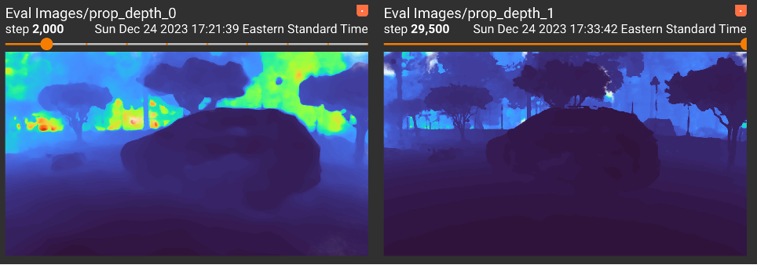
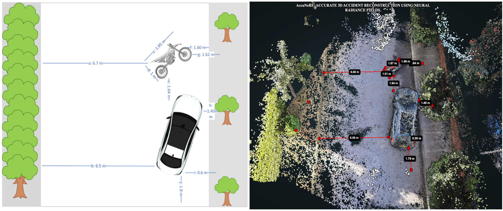
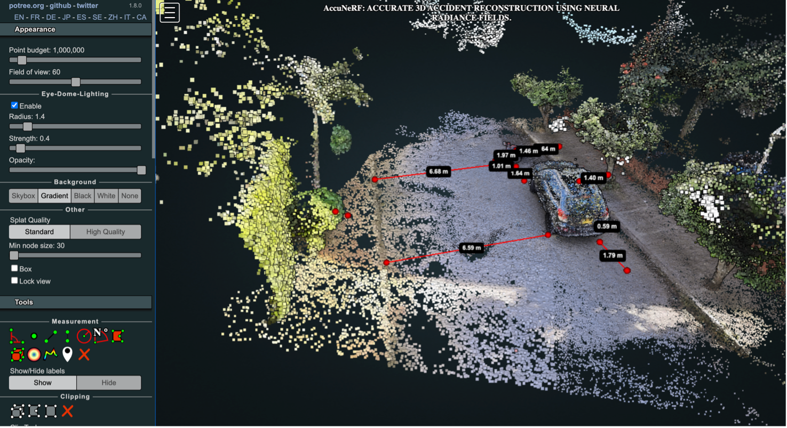

<div align="center">
  <a href="https://www.mit.edu/~arosinol/">
    
  </a>
</div>

<p align="center">
  <div align="center">
    <h1>AccuNeRF</h1>
  </div>
  <h1 align="center">
  ACCURATE 3D ACCIDENT RECONSTRUCTION USING NEURAL RADIANCE FIELDS</h1>
  <p align="center">
    <a href="https://www.adonaivera.com/"><strong>ADONAI VERA</strong></a>
    ·
    <a href="https://www.iu.de/hochschule/lehrende/grasnick-armin/"><strong>PROF. DR. ARMIN GRASNICK</strong></a>
  </p>
  Accurate damage documentation post-automobile accidents are a significant challenge in the insurance industry. Traditional methods often fall short of precision and detail, leading to discrepancies in damage reports. In the United States alone, there are approximately 6 million car accidents yearly, resulting in over $160 billion in economic losses, including medical expenses and property damage (Administration, The National Highway Traffic Safety, 2023). In this context, our study introduces AccuNeRF, an innovative application of Neural Radiance Fields (NeRF), developed to construct digital twins of damaged vehicles using conventional smartphone video capture. Our research delves into the effectiveness and constraints of NeRF for precise 3D reconstruction of damaged vehicles, accounting for video quality and environmental factors. Additionally, we establish a comprehensive pipeline, guiding the transformation from input images to user-friendly digital twin interfaces, streamlining accident analysis. Notably, we introduce an innovative post-processing step utilizing a Denoising Autoencoder with Spatial Attention architecture (Point-DAE) to enhance point cloud quality, contributing to the overall robustness of our approach. These advancements serve as critical components of our research, advancing the field of digital vehicle reconstruction. Our findings could bridge the gap between current damage reporting limitations and the promise of cutting-edge machine learning tools, setting the stage for more accurate, swift, and detailed assessments in the insurance domain.
  <!-- <h2 align="center">In Review</h2> -->
  <h3 align="center">
    <a href="https://arxiv.org/abs/">Paper</a> |
    <a href="https://youtu.be/mkaa-u1oG0c">Video</a> |
    <!-- <a href="">Project Page</a>-->
  </h3>
  <div align="center"></div>
</p>

<p align="center">
  <a href="#">
    
  </a>
</p>


<details open="open" style='padding: 10px; border-radius:5px 30px 30px 5px; border-style: solid; border-width: 1px;'>
  <summary>Table of Contents</summary>
  <ol>
    <li>
      <a href="#install">Install</a>
    </li>
    <li>
      <a href="#download-sample-data">Download Datasets</a>
    </li>
    <li>
      <a href="#Implementation">Implementation</a>
    </li>
    <li>
      <a href="#run">Run</a>
    </li>
    <li>
      <a href="#results">Results</a>
    </li>
    <li>
      <a href="#citation">Citation</a>
    </li>
    <li>
      <a href="#license">License</a>
    </li>
    <li>
      <a href="#acknowledgments">Acknowledgments</a>
    </li>
    <li>
      <a href="#contact">Contact</a>
    </li>
  </ol>
</details>

## Install

Clone repo with submodules:
```
git clone https://github.com/AdonaiVera/AccuNeRF.git --recurse-submodules --branch develop
```

###  Install Potree
Install [node.js](http://nodejs.org/)

Install dependencies, as specified in package.json, and create a build in ./build/potree.

```bash
npm install
```

### Install NerfStudio

1. Setup conda enviroment

```bash
conda create --name accunerf -y python=3.8
conda activate nerfbusters
python -m pip install --upgrade pip


2. Install Nerfstudio and dependencies. Installation guide can be found [install nerfstudio](https://docs.nerf.studio/en/latest/quickstart/installation.html)


```bash
cd path/to/nerfstudio

pip install torch==2.1.2+cu118 torchvision==0.16.2+cu118 --extra-index-url https://download.pytorch.org/whl/cu118
conda install -c "nvidia/label/cuda-11.8.0" cuda-toolkit
pip install ninja git+https://github.com/NVlabs/tiny-cuda-nn/#subdirectory=bindings/torch


pip install -e .

``` 


## Init code
Open two scripts to run the frontend and the backend in the same computer.

Use the `npm start` command to 

* create ./build/potree 
* watch for changes to the source code and automatically create a new build on change
* start a web server at localhost:1234. 

Go to http://localhost:1234/examples/dashboard.html to test the examples.


## Download Sample Data

pending

## Implementation
In the implementation phase, we bring our research to fruition, transforming the proposed methodology into a functional software application known as AccuNeRF. This section will delve into the various components of the AccuNeRF pipeline, illustrating how each stage contributes to the precise 3D reconstruction of accident scenes. The pipeline outlined below represents an intricate system engineered to transform single-camera imagery into a vividly detailed three-dimensional space. It is a composite framework that amalgamates the 3D surface reconstruction prowess of Nerfacto. From the initial phase of image capture to the final rendering, the pipeline employs a series of interconnected modules, each specialized for a critical aspect of the scene creation process. The intricacies of these modules and their interplay are visually depicted in the subsequent diagram, providing a clear depiction of the pipeline's methodology and its holistic approach to 3D scene construction and enhancement (see Image below).

<p align="center">
  <a href="#">
    
  </a>
</p>


## Run

pending


## Results
<p align="center">
  <a href="#">
    
  </a>
</p>

<p align="center">
  <a href="#">
    
  </a>
</p>

<p align="center">
  <a href="#">
    
  </a>
</p>


## Citation 📦

pending

## License 📌

Pending to ADD

## Acknowledgments 🤓

Based on [NeRF++ codebase](https://github.com/Kai-46/nerfplusplus) and inherits the same training data preprocessing and format.

## Build with 🛠️
_Mention the tools you used to create your project_

Pending to add

## Contact 🎁

If you are interested in building on top of this, feel free to reach out :) 
* **Adonai Vera** - *AI developer Geta Club* - [AdonaiVera](https://github.com/AdonaiVera)